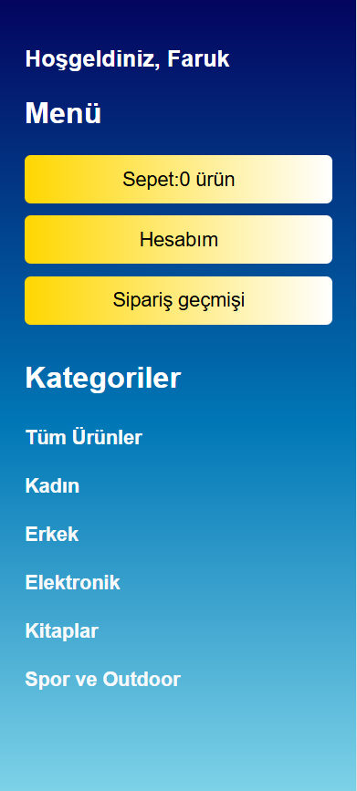

# SahipOl E-Ticaret Sitesi

Bu proje, web programlama dersi kapsamında PHP ve SQL Server kullanılarak geliştirilmiş bir e-ticaret sitesidir.

## Özellikler
- Kullanıcı kaydı ve girişi
- Satıcı ve müşteri panelleri
- Ürün arama ve filtreleme
- Kategorilerle ürün listeleme
- Sepet ve sipariş yönetimi

## Kurulum

1. Proje dosyalarını local veya sunucuya yükleyin.
2. `giris.php` ve benzeri bağlantı dosyalarında veritabanı ayarlarınızı kendi ortamınıza göre düzenleyin:
    ```php
    $serverName = "YOUR_SERVER";
    $connectionOptions = [
        "Database" => "YOUR_DATABASE",
        "Uid" => "YOUR_USERNAME",
        "PWD" => "YOUR_PASSWORD",
        "CharacterSet" => "UTF-8"
    ];
    ```
3. SQL Server'da gerekli tabloları ve veritabanını oluşturun.
4. Siteyi bir PHP sunucusunda çalıştırın.

---

## Ekran Görüntüleri

### Kullanıcı Giriş ve Kayıt Ekranları

- Kullanıcılar giriş yapabilir, yeni üye olabilir veya satıcı olarak giriş yapabilirler.


---

### Ürünler ve Kategoriler

- Kullanıcılar çeşitli kategorilerdeki ürünleri görüntüleyebilir ve filtreleme yapabilir.




---

### Sipariş Geçmişi

- Kullanıcılar geçmiş siparişlerini ve detaylarını görüntüleyebilir.


---

### Sepet Yönetimi

- Kullanıcılar sepetlerine ürün ekleyebilir, silebilir ve sipariş oluşturabilirler.


---

## Veritabanı ER Diyagramı

Aşağıda projenin temel veritabanı ilişkilerini görebilirsiniz:


---

## Katkı ve Lisans

Ders projesidir. Geliştirmek veya katkı sunmak isteyenler issue açabilir.
